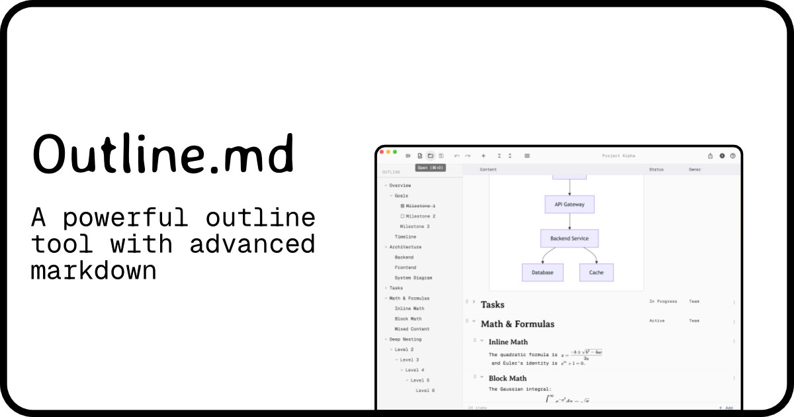

# Outline.md



A cross-platform, markdown-based hierarchical outline editor built with Flutter. Create structured documents using familiar markdown headings, export to LaTeX, and organize your thoughts with drag-and-drop, collapsible sections, and custom columns.

## Features

- **Hierarchical outlining** — Use markdown headings (`#` through `######`) to define a nested document structure
- **Rich markdown editing** — Bold, italic, code, lists, blockquotes, tables, and fenced code blocks
- **Collapse / expand** — Toggle individual sections or collapse/expand all at once
- **Checkboxes** — Add `- [ ]` / `- [x]` task items and toggle them from the UI
- **Custom columns** — Define extra columns (e.g. Status, Time) via YAML front-matter or the toolbar; values are stored per heading
- **Drag and drop** — Reorder nodes by dragging above, below, or as a child of another node
- **Sidebar navigation** — Outline tree panel for quick navigation and selection
- **File operations** — New, Open, Save (`.md`); unsaved-changes prompt on close
- **LaTeX export** — Export the full document to a `.tex` file with images copied to an `images/` subfolder
- **Keyboard shortcuts** — `⌘/Ctrl+N/O/S`, `Tab`/`Shift+Tab` for indent/outdent, `⌘/Ctrl+↑/↓` to move nodes, `Enter` to add nodes
- **Theming** — System, Light, and Dark modes
- **Desktop-native** — Custom window chrome via `window_manager` on macOS, Linux, and Windows

## Markdown Format

Documents are standard `.md` files with an optional YAML front-matter block for metadata:

```markdown
---
title: "My Document"
columns: [Status, Priority]
---

# Introduction
Some body text under this heading.

## Task One | Done | High
- [x] Completed item

## Task Two | In Progress | Low
- [ ] Pending item
```

Headings define the tree structure. Column values are appended to heading lines separated by `|`.

## Building

### Prerequisites

- [Flutter](https://docs.flutter.dev/get-started/install) **3.41.0** or later (stable channel)
- For **Linux**: `libgtk-3-dev`, `ninja-build`, `clang`, `cmake`, `pkg-config`, `libblkid-dev`, `liblzma-dev`
- For **Windows**: Visual Studio with C++ desktop development workload

### Development

```bash
# Install dependencies
flutter pub get

# Run in debug mode
flutter run -d macos    # or: linux, windows

# Run analysis
flutter analyze

# Run tests
flutter test
```

### Release Build

```bash
# macOS
flutter build macos --release

# Linux
flutter build linux --release

# Windows
flutter build windows --release
```

Build outputs are located in:

| Platform | Output path |
|----------|-------------|
| macOS | `build/macos/Build/Products/Release/Outline.md.app` |
| Linux | `build/linux/x64/release/bundle/` |
| Windows | `build/windows/x64/runner/Release/` |

## CI / CD

Two GitHub Actions workflows live in `.github/workflows/`:

### `ci.yml` — Continuous Integration

Runs on **every push** to any branch. Steps:

1. Install Flutter 3.41.0
2. `flutter pub get`
3. `flutter analyze`
4. `flutter test`

### `build-binaries.yml` — Build & Release

Triggered **manually** (`workflow_dispatch`) or on **tag push** (`v*`). Builds the app for all three desktop platforms:

| Platform | Runner | Architecture |
|----------|--------|-------------|
| macOS | `macos-14` | Apple Silicon (arm64) |
| Linux | `ubuntu-22.04` | x86_64 |
| Windows | `windows-latest` | x86_64 |

On tag push (e.g. `git tag v1.0.0 && git push --tags`), the workflow also creates a **GitHub Release** with packaged archives for each platform.

**macOS code signing & notarization** is supported when the following repository secrets are configured:

- `MACOS_CERTIFICATE_P12` — Base64-encoded `.p12` signing certificate
- `MACOS_CERTIFICATE_PASSWORD` — Certificate password
- `MACOS_CERT_NAME` — Certificate identity name
- `APPLE_ID`, `APPLE_APP_PASSWORD`, `APPLE_TEAM_ID` — For notarization

## Project Structure

```
lib/
├── main.dart                          # Entry point
├── app.dart                           # MaterialApp setup
├── models/
│   ├── outline_node.dart              # Tree node model
│   ├── outline_document.dart          # Document model
│   └── column_def.dart                # Column definition
├── providers/
│   ├── document_provider.dart         # Document state (Riverpod)
│   └── theme_provider.dart            # Theme & sidebar state
├── services/
│   ├── markdown_parser.dart           # Markdown → OutlineDocument
│   ├── markdown_serializer.dart       # OutlineDocument → Markdown
│   ├── latex_exporter.dart            # OutlineDocument → LaTeX
│   └── file_service.dart              # File I/O with file_picker
├── features/
│   ├── editor/                        # Main editor screen & widgets
│   ├── toolbar/                       # Top toolbar
│   ├── sidebar/                       # Outline tree sidebar
│   └── help/                          # Help dialog
├── theme/                             # Light/dark themes
└── utils/
    ├── tree_utils.dart                # Tree manipulation helpers
    └── platform_utils.dart            # Platform detection
```

## License

See the [LICENSE](LICENSE) file for details.
