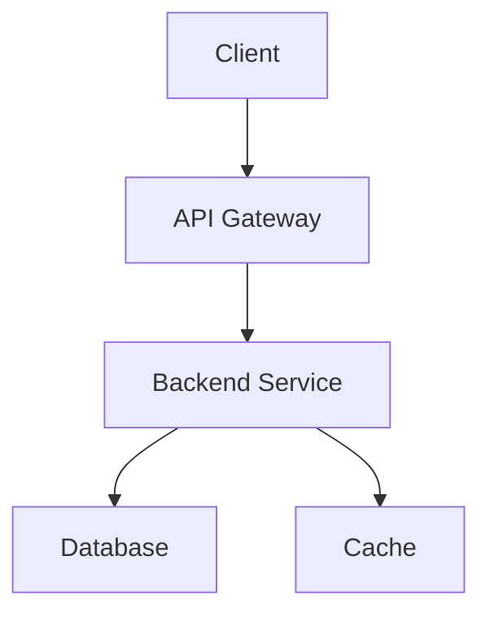

# Overview | Planning | Team
This is the **project overview** with *italic emphasis* and `inline code`.

## Goals | Active | Alice
The main goals of the project are outlined here.

### [x] Milestone 1 | Done | Bob
This milestone is complete.

- Delivered on time
- All tests passing

### [ ] Milestone 2 | Pending | Carol
Still working on this one.

### Milestone 3 | Blocked | Dave

## Timeline
- Phase 1: Research
- Phase 2: Development
- Phase 3: Launch

# Architecture | Active | Team

## Backend
The backend is written in **Rust** with `tokio` for async.


```rust
async fn main() {
    let app = Router::new()
        .route("/api", get(handler));
    axum::serve(listener, app).await.unwrap();
}
```

## Frontend
The frontend uses *React* and **TypeScript**.

```typescript
function App(): JSX.Element {
  return <div>Hello World</div>;
}
```

## API Endpoints

| Method | Endpoint       | Description         |
|--------|----------------|---------------------|
| GET    | /api/users     | List all users      |
| POST   | /api/users     | Create a new user   |
| GET    | /api/users/:id | Get user by ID      |
| DELETE | /api/users/:id | Delete a user       |

## System Diagram



# Tasks | In Progress | Team

## [x] Design | Done | Alice
Design phase is complete.

## [ ] Implementation | In Progress | Bob
Currently implementing core features.

## [ ] Testing | Pending | Carol

# Math & Formulas | Active | Team

## Inline Math
The quadratic formula is $x = \frac{-b \pm \sqrt{b^2 - 4ac}}{2a}$ and Euler's identity is $e^{i\pi} + 1 = 0$.

## Block Math
The Gaussian integral:

$$
\int_{-\infty}^{\infty} e^{-x^2} dx = \sqrt{\pi}
$$

And the definition of a derivative:

$$
f'(x) = \lim_{h \to 0} \frac{f(x+h) - f(x)}{h}
$$

## Mixed Content
Here is text with $\alpha + \beta = \gamma$ inline math, **bold text**, and `code`.

- Item with math: $a^2 + b^2 = c^2$
- Plain item without math

# Deep Nesting

## Level 2
Content at level 2.

### Level 3
Content at level 3.

#### Level 4
Content at level 4.

##### Level 5
Content at level 5.

###### Level 6
Content at the deepest level with **bold**, *italic*, and `code`.


