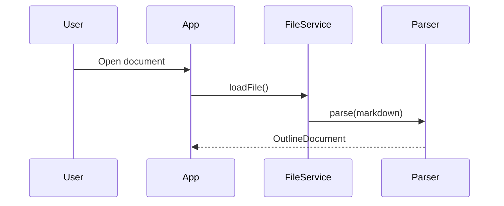

# Meeting Notes

## Action Items
- [x] Review the proposal
- [ ] Send follow-up email
- [ ] Schedule next meeting

## Discussion Points
We discussed the following topics:

### Performance
The app is rendering slowly on older devices. We need to look into:

- Virtual scrolling for large lists
- Image lazy loading
- Memoization of expensive computations

```dart
class PerformanceMonitor {
  final Stopwatch _stopwatch = Stopwatch();

  void startMeasure() => _stopwatch.start();
  Duration endMeasure() {
    _stopwatch.stop();
    return _stopwatch.elapsed;
  }
}
```

### Design
The new mockups look great.


### Architecture



## Decisions
1. We will use Flutter for the frontend.
2. Backend will be serverless.
3. Launch target is Q3.

## Next Steps
Schedule a follow-up for next **Tuesday** at `10:00 AM`.

### Assignments
- [x] Alice: finalize mockups
- [ ] Bob: prototype the API
- [ ] Carol: write integration tests

# Technical Details

## Complexity Analysis
The algorithm runs in $O(n \log n)$ time and uses $O(n)$ space.

The recurrence relation is:

$$
T(n) = 2T(n/2) + O(n)
$$

Which solves to $T(n) = O(n \log n)$ by the Master theorem.

## Physics Notes
Einstein's famous equation $E = mc^2$ relates energy and mass.

The Schrödinger equation in one dimension:

$$
i\hbar \frac{\partial}{\partial t} \Psi(x,t) = -\frac{\hbar^2}{2m} \frac{\partial^2}{\partial x^2} \Psi(x,t) + V(x)\Psi(x,t)
$$

# References
See the *official documentation* at [flutter.dev](https://flutter.dev).

Some `code snippets` and **important notes** are inline here.
